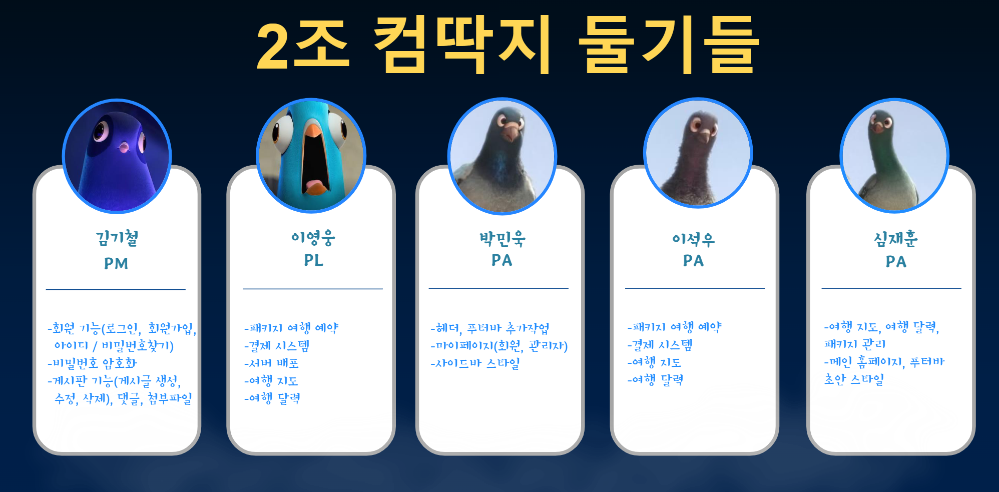

# 프로젝트: [Viva La Fiestas](https://viva-la-fiestas.com)

  

 

# 프로젝트 개발 팀: 컴딱지 둘기들

  

 

# 프로젝트 소개
> 개발 배경 
- 이원화되어 운영되고 있는 일반 지역축제 및 문화관광축제 페이지 통합 운영 필요
- 시각적 도구를 통한 직관적 정보전달
- 최신 축제 정보 제공을 통한 축제 정보 서비스 경험 개선 및 고객 유입 확대

> 개발 목적
- 대한민국 구석구석 홈페이지를 참 고하여 독립적인 홈페이지 구축
- 전국 지역축제 정보 통합 제공
- 서비스 경험(UX/UI) 개선
- 사용자 이용 편의성 제고
